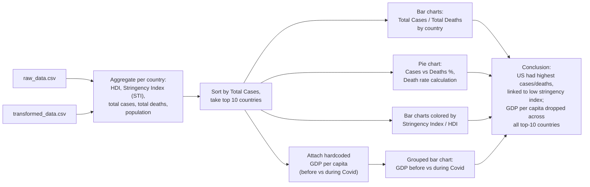

# Covid-19 Impact Analysis

A single Jupyter notebook that analyzes COVID-19 spread and its economic impact using `transformed_data.csv` and `raw_data.csv`, aggregating total cases/deaths, Human Development Index (HDI), and Stringency Index by country, then comparing the top-10 hardest-hit countries' GDP per capita before vs. during the pandemic (hardcoded GDP figures).

## Tech stack

- Python
- pandas
- Plotly (`plotly.express`, `plotly.graph_objects`) for bar, grouped-bar, and pie charts
- Jupyter Notebook

## Architecture

## Setup / How to run

The repo contains only the notebook, `COVID-Analysis.ipynb`; the source CSVs (`transformed_data.csv`, `raw_data.csv`) are not included in the repository and must be supplied separately to reproduce the analysis.

1. Install dependencies: `pip install pandas plotly`
2. Place `transformed_data.csv` and `raw_data.csv` in the same directory as the notebook.
3. Open and run `COVID-Analysis.ipynb` in Jupyter.
